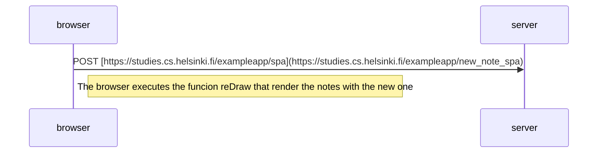

```mermaid

sequenceDiagram
    participant browser
    participant server

    browser->>server: POST [https://studies.cs.helsinki.fi/exampleapp/spa](https://studies.cs.helsinki.fi/exampleapp/new_note_spa)
    activate server
    Note right of browser: The browser executes the funcion reDraw that render the notes with the new one

```
